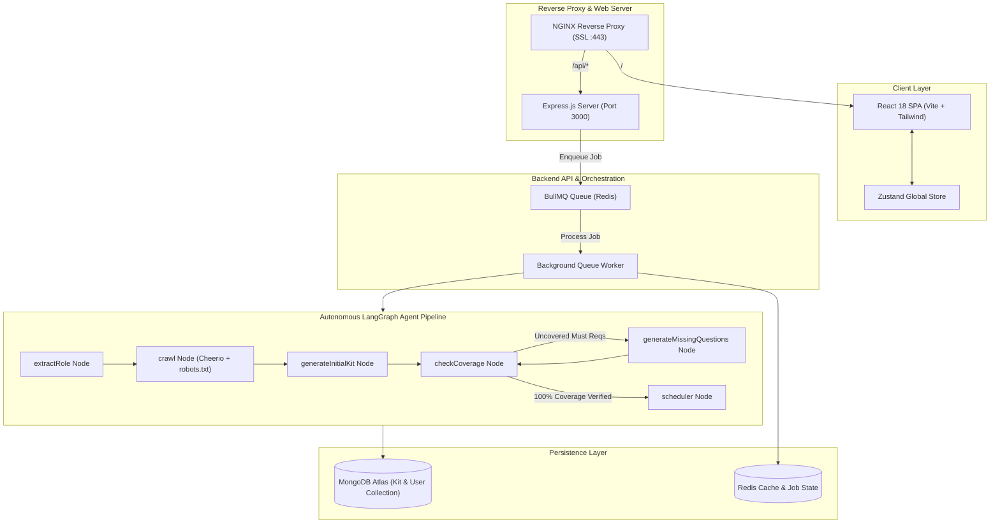
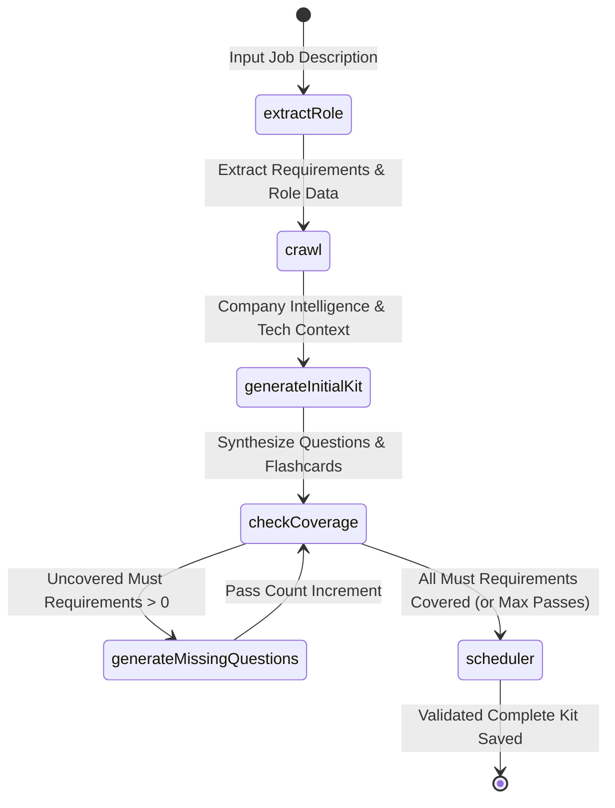

# ⚡ Zeno — AI-Powered Interview Preparation Copilot

> **Enterprise-grade, multi-stage interview kit generator and personalized revision studio powered by LangGraph, Express, React, and BullMQ.**

---

## 📑 Table of Contents
1. [Monorepo Architecture Justification](#-why-a-monorepo-architecture)
2. [Project Overview & Tech Stack](#-project-overview--chosen-tech-stack)
3. [LLM Providers & Models](#-llm-providers--models)
4. [High-Level Architecture](#-high-level-architecture)
5. [Retrieval Approach & Web Intelligence](#-retrieval-approach--sources-used)
6. [Research & Generation Pipeline (LangGraph Workflow)](#-sequencing-of-research--generation-steps)
7. [State Representation: Generated, Edited & Pinned State](#-state-representation-generated-edited--pinned-state)
8. [Deterministic Schedule Allocation Algorithm](#-schedule-allocation-algorithm)
9. [Creative Features & Practice Arena](#-creative-features--practice-mode)
10. [Local & Deployment Setup Instructions](#-setup-instructions-local--deployed)
11. [Batch Evaluation Entry Point](#-batch-evaluation-entry-point)
12. [Key Design Decisions, Trade-Offs & Known Limitations](#-key-design-decisions-trade-offs--known-limitations)

---

## 🏛️ Why a Monorepo Architecture?

Zeno is structured as an **NPM Workspaces Monorepo** (`apps/backend`, `apps/frontend`, and `packages/shared`). This design was chosen based on the following architectural justifications:

```
zeno/
├── apps/
│   ├── backend/          # Express API, BullMQ Queue Worker, LangGraph AI Pipeline, Web Crawler
│   └── frontend/         # React SPA, Vite, Tailwind CSS, Zustand, Interactive Practice Arena
├── packages/
│   └── shared/           # Single Source of Truth for Zod Schemas & TypeScript Contract Types
├── .github/workflows/    # Automated CI/CD GitHub Actions Workflow
├── docker-compose.yml    # Container orchestration for App, MongoDB, and Redis
├── ecosystem.config.js   # PM2 Process Manager Configuration
└── package.json          # Root Monorepo workspace configuration
```

### Key Architectural Benefits:
1. **End-to-End Type Safety & Shared Schema Validation (`@zeno/shared`)**:
   - Both the React frontend and Node.js backend consume identical **Zod Schemas** (`KitSchema`, `QuestionSchema`, `RoleSchema`, `FlashcardSchema`, `ScheduleSchema`).
   - If a schema field evolves (e.g., adding `isPinned` or updating difficulty metrics), TypeScript compilation and Zod runtime validation immediately enforce contract integrity across both apps during build time.
2. **Atomic Commits & Synchronized CI/CD**:
   - Contract changes, frontend UI adaptations, and backend worker handlers are reviewed, tested, and deployed in a single atomic commit without API version skew or broken client-server mismatches.
3. **Single Build & Dependency Pipeline**:
   - Monorepo-level scripts (`npm run build`, `npm run dev`) build and run all packages in parallel using unified workspace resolution, eliminating the need to publish internal packages to private npm registries.

---

## 🚀 Project Overview & Chosen Tech Stack

Zeno transforms raw job descriptions and company URLs into deep, production-grade interview preparation kits. It automatically extracts requirements, conducts autonomous web intelligence research on the target company, synthesizes realistic multi-category questions with complete rubric scoring outlines, verifies 100% test coverage of all *Must-Have* competencies, and schedules a day-by-day study roadmap with interactive flashcard revision.

### Technology Stack & Justification

| Layer | Technologies | Justification |
| :--- | :--- | :--- |
| **Frontend** | **React 18, Vite, Tailwind CSS** | Blazing-fast HMR, lightweight SPA footprint, modern dark glassmorphism design system. |
| **State Management** | **Zustand** | Minimalist boilerplate, instant UI reactivity, seamless localStorage & server synchronization without Redux overhead. |
| **Interactive UI** | **`@hello-pangea/dnd`, Lucide Icons** | Fluid, accessible drag-and-drop reordering for interview questions with zero lag. |
| **Backend API** | **Node.js, Express, TypeScript** | Robust REST API, strict typing, centralized error handling, and structured middleware. |
| **AI Orchestration** | **LangGraph, LangChain (`@langchain/langgraph`)** | Cyclic state-machine workflow with conditional branching, feedback loops, and coverage verification. |
| **Job Queue & Worker** | **BullMQ, Redis (ioredis)** | Asynchronous decoupled queue preventing HTTP timeouts during long-running crawler and LLM tasks. |
| **Database** | **MongoDB Atlas, Mongoose** | Flexible document storage matching the JSON schema, storing revision histories and confidence maps. |
| **Web Crawler** | **Cheerio, robots-parser, Axios** | High-performance HTML scraping with strict RFC-compliant `robots.txt` rate limiting and keyword discovery. |


---

## LLM Providers & Models

Zeno supports multiple model providers through a pluggable LangChain abstraction (`getChatModel()` in `nodes.ts`):

- **Default Primary Model**: **OpenAI `gpt-4o-mini`** (or `gpt-4o`)
  - *Why*: Exceptional structured JSON output compliance (`withStructuredOutput`), low latency, and deep technical evaluation accuracy for software engineering rubrics.
- **Supported Alternative**: **Google Gemini `gemini-1.5-flash` / `gemini-2.5-flash`** via `@langchain/google-genai`.
- **Supported High-Speed OSS**: **Groq `llama-3.3-70b-versatile`** via `@langchain/openai`.

The active model is dynamically selected via environment variables (`OPENAI_API_KEY` or `GEMINI_API_KEY`) with deterministic temperature controls (`temperature: 0.2`) to eliminate hallucinations and preserve strict schema compliance.

---

## High-Level Architecture



---

## 🔍 Retrieval Approach & Sources Used

Zeno implements a **2-Tier Autonomous Crawler** that extracts rich context while strictly adhering to web standards:

```
[Target Company URL] ──► robots.txt Check (Allowed?) ──► Sitemap & Subpage Scoring ──► Context Synthesis
                                    │
                                    └──► Public Interview Intelligence Retrieval
```

1. **RFC 9309 `robots.txt` Compliance**:
   - Before requesting any domain, the crawler downloads and parses `robots.txt` using `robots-parser`.
   - If crawling is disallowed by rule or wildcard, the crawler gracefully aborts direct scraping and records the restriction.
2. **Targeted Subpage Heuristics**:
   - Rather than crawling arbitrary pages, the crawler prioritizes high-value subpages by keyword scoring: `/about`, `/careers`, `/engineering`, `/tech-stack`, `/values`, `/culture`.
3. **Public Community Interview Intelligence**:
   - Searches public technical discussions and engineering interview reviews to extract authentic engineering values, tech stacks, and culture norms.
4. **Resilient Sanitization**:
   - Strips boilerplate navigation, scripts, ads, and footers with Cheerio, distilling text into a compact, high-signal context window.

---

## 🔄 Sequencing of Research & Generation Steps

The generation lifecycle is coordinated via a **LangGraph StateGraph** (`workflow.ts`):



### Detailed Node Responsibilities:

| Node | Name | Responsibility |
| :---: | :--- | :--- |
| **1** | `extractRole` | Parses raw JD into structured role attributes: title, seniority, responsibilities, and classified requirements (`technical`, `behavioural`, `domain`) categorized by priority (`must` vs `nice`). |
| **2** | `crawl` | Inspects `robots.txt`, crawls company pages, extracts engineering context, and compiles the source metadata (`pages_used`, `researched_at`). |
| **3** | `generateInitialKit` | Synthesizes the initial **Company Brief**, multi-category **Questions** mapped to requirement IDs, and **Flashcards**. |
| **4** | `checkCoverage` | Mathematical evaluation comparing all `must` requirements against generated `requirement_ids`. Computes uncovered IDs and pass iterations. |
| **5** | `generateMissingQuestions` | Targeted LLM loop that generates specific questions exclusively targeting uncovered `must` requirement IDs. |
| **6** | `scheduler` | Deterministic algorithm that computes day allocations, time budgets, and daily focus tracks based on available days (1 to 14 days). |

---

## 📌 State Representation: Generated, Edited & Pinned State

One of Zeno's core features is **Partial Section Regeneration with Guaranteed User Edit Survival**:

```typescript
// Question Schema with State Preservation
export const QuestionSchema = z.object({
  id: z.string(),
  requirement_ids: z.array(z.string()),
  category: z.enum(['technical', 'behavioural', 'system-design', 'company-fit']),
  prompt: z.string(),
  answer_outline: z.string(),
  difficulty: z.number().int().min(1).max(3).default(2),
  isPinned: z.boolean().default(false).optional(), // 🛡️ Preserves user manual edits
});
```

### How State is Handled:
1. **Generated State**: Fresh questions generated by the AI start with `isPinned: false`.
2. **Edited State**: Whenever a user modifies a question prompt, changes the answer rubric, adjusts difficulty, or reorders questions via Drag-and-Drop, the Zustand store automatically sets **`isPinned: true`**.
3. **Partial Category Regeneration (`regenerateCategoryService`)**:
   - When the user clicks **"Regenerate Category"** on a specific section (e.g. *Technical*), the backend:
     - **Keeps 100% of questions in other categories** (*System Design*, *Behavioural*, *Company Fit*).
     - **Preserves any pinned question (`isPinned === true`) in the active category**.
     - Generates 3-4 brand-new questions for the unpinned slots.
     - Automatically recalculates the study schedule without discarding user work.

---

## ⏱️ Schedule Allocation Algorithm

Rather than relying on unpredictable LLM time hallucinations, Zeno uses a **Deterministic Mathematical Scheduler** (`scheduler.service.ts`):

```
Total Questions (N) ÷ Days Available (D) ──► Day Allocation Distribution
                                                      │
                       Difficulty & Item Weight ──────┴──► Daily Time Budget (Minutes)
```

1. **Day Sanitization**: Normalizes user input between 1 and 14 days (default: 3 days).
2. **Question Partitioning**:
   - Calculates base questions per day: `Math.floor(totalQuestions / totalDays)`.
   - Distributes remaining questions evenly across the initial study days.
3. **Dynamic Day Focus**:
   - Analyzes category distribution of questions assigned to each day and assigns an intuitive focus title (e.g. *Day 1: Technical & Core Systems*, *Day 2: System Architecture & Behavioural*).
4. **Time Budget Calculation**:
   - Computes estimated minutes per day based on question count, difficulty ratings (1=Easy to 3=Hard), and rubric complexity, ensuring a realistic, achievable preparation pacing.

---

## ⚡ Creative Features & Practice Mode

### 1. Interactive 3D Spaced-Repetition Practice Arena (`PracticeMode.tsx`)
- **3D Flip Cards**: Sleek animated card flip showing front concepts and back answer rubrics with full markdown heuristics.
- **Self-Assessment Rating**: Users rate their confidence on each card:
  - 🔴 **Hard (1)**: Card is prioritized for immediate re-testing.
  - 🟡 **Good (2)**: Standard spaced interval.
  - 🟢 **Easy (3)**: Pushed to the end of the revision queue.
- **Smart Queue Sorting**: Priority algorithm orders unseen and *Hard* cards first.
- **Full Keyboard Navigation**:
  - `Space` or `Enter`: Flip card / Show answer
  - `1`, `2`, `3`: Select confidence score
  - `R`: Restart practice deck
- **Persistent Cloud Synchronization**: Scores persist across sessions and devices via MongoDB.

### 2. Fluid Drag & Drop Kit Builder
- Powered by `@hello-pangea/dnd`.
- Reorder questions across categories with real-time optimistic updates in the Zustand store.
- Custom difficulty selectors and one-click pinning toggles.

### 3. One-Click JSON Export
- Export the entire generated kit in strict compliance with the evaluation schema specifications.

---

## 🛠️ Setup Instructions (Local & Deployed)

### Prerequisites
- Node.js >= 18.x
- NPM >= 9.x
- MongoDB (Local or MongoDB Atlas)
- Redis Server (Local or Cloud Redis)
- OpenAI or Gemini API Key

---

### 💻 Local Development Setup

#### 1. Clone the Repository:
```bash
git clone https://github.com/shakti2505/Zeno.git
cd Zeno
```

#### 2. Install Dependencies from Root:
```bash
npm install
```

#### 3. Configure Environment Variables:
Create `.env` in `apps/backend/.env`:
```env
PORT=3000
NODE_ENV=development
MONGODB_URI=mongodb://localhost:27017/zeno
REDIS_URL=redis://localhost:6379
JWT_SECRET=zeno_super_secret_jwt_key_dev_2026
FRONTEND_URL=http://localhost:5173
OPENAI_API_KEY=sk-proj-your-openai-api-key
```

#### 4. Run Development Servers (Concurrently):
```bash
# Starts both Backend (Port 3000) and Frontend (Port 5173)
npm run dev
```

---

### 🌐 VPS Production Deployment (PM2 + NGINX)

#### 1. Build Monorepo Workspaces:
```bash
cd /root/Zeno
npm run build
```

#### 2. Start PM2 Backend:
```bash
pm2 start ecosystem.config.js
pm2 save
```

#### 3. NGINX Reverse Proxy Configuration:
Add to `/etc/nginx/sites-available/zeno`:
```nginx
server {
    server_name zeno.devnixai.com;

    # Serve Built Frontend SPA
    location / {
        root /root/Zeno/apps/frontend/dist;
        index index.html;
        try_files $uri $uri/ /index.html;
    }

    # Proxy API Requests to Backend Port 3000
    location /api/ {
        proxy_pass http://127.0.0.1:3000;
        proxy_http_version 1.1;
        proxy_set_header Upgrade $http_upgrade;
        proxy_set_header Connection 'upgrade';
        proxy_set_header Host $host;
        proxy_set_header X-Real-IP $remote_addr;
        proxy_set_header X-Forwarded-For $proxy_add_x_forwarded_for;
        proxy_set_header X-Forwarded-Proto $scheme;
    }

    listen 443 ssl;
    # Certbot SSL lines...
}
```

---

## 🧪 Batch Evaluation Entry Point

To execute the automated batch generation evaluation script:

```bash
# From the project root:
npm run evaluate -- --input <path> --output <path>
```

Or directly inside `apps/backend`:
```bash
cd apps/backend
npx ts-node src/cli/evaluate.ts
```

### Batch Evaluation Specifications:
- **Input File**: Reads test cases from [`apps/backend/evaluation_input.json`](file:///d:/zeno/apps/backend/evaluation_input.json).
- **Output File**: Writes verified JSON artifacts matching Appendix A schema to [`apps/backend/evaluation_output.json`](file:///d:/zeno/apps/backend/evaluation_output.json).

---

## ⚖️ Key Design Decisions, Trade-Offs & Known Limitations

### Design Decisions & Trade-Offs

| Decision | Alternative Considered | Rationale & Trade-Off |
| :--- | :--- | :--- |
| **LangGraph Cyclic State Machine** | Linear LangChain Pipeline / Sequential Scripts | Cyclic graphs allow deterministic error recovery, feedback loops (`checkCoverage`), and multi-pass repair without fragile chain nesting. |
| **Asynchronous BullMQ Queue** | Synchronous REST Request | Multi-page web crawling and LLM synthesis take 15-45 seconds. An async queue prevents HTTP connection drops and browser timeouts. |
| **Deterministic Schedule Calculation** | LLM-generated Schedule | LLMs frequently hallucinate conflicting dates, negative study times, or skip questions. A mathematical scheduler provides 100% consistent pacing. |
| **NPM Workspaces Monorepo** | Polyrepo / Separate Repositories | Guarantees synchronized schema versions (`@zeno/shared`) between frontend and backend without private npm registry overhead. |

### Known Limitations & Roadmap
1. **JavaScript-Heavy SPAs during Crawling**: Cheerio crawls static HTML. Sites that render 100% client-side without SSR or meta tags yield reduced context. (Future Roadmap: Add optional headless browser fallback with Playwright).
2. **Rate Limits on Target Sites**: Strict firewalls (e.g. Cloudflare Bot Management) may block crawler IPs. Zeno handles this gracefully with safe fallbacks.
3. **Multi-Language Support**: Currently optimized for English interview preparations.

---

## 👥 Authors
- **Project**: Zeno AI Interview Copilot
